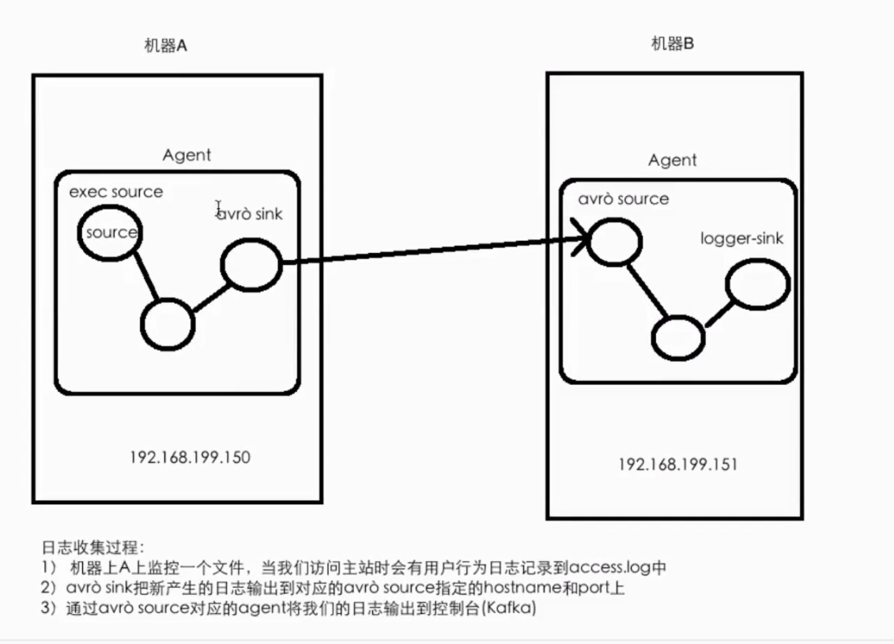

## <span id="mulu">目录</span>
 
<a href="#flume">flume</a>  
<a href="#kafka">kafka</a>

## <span id="flume">1. flume</span>  
<a href="#mulu">[回到目录]</a>

### 从制定网络端口采集数据输出到控制台
```flume
#Name the components on this agent
a1.sources = r1
a1.sinks = k1
a1.channels = c1

# Describe/configure the source
a1.sources.r1.type = exec
a1.sources.r1.command = tail -F /opt/module/hive/logs/hive.log

# Describe the sink
a1.sinks.k1.type = logger

# Use a channel which buffers events in memory
a1.channels.c1.type = memory

# Bind the source and sink to the channel
a1.sources.r1.channels = c1
a1.sinks.k1.channel = c1

```

### 监控一个文件实时采集新增的数据输出到控制台
```flume
#Name the components on this agent
a1.sources = r1
a1.sinks = k1
a1.channels = c1

# Describe/configure the source
a1.sources.r1.type = exec
a1.sources.r1.command = tail -F /opt/module/hive/logs/hive.log

# Describe the sink
a1.sinks.k1.type = logger

# Use a channel which buffers events in memory
a1.channels.c1.type = memory

# Bind the source and sink to the channel
a1.sources.r1.channels = c1
a1.sinks.k1.channel = c1

```

```bash
flume-ng agent \ 
--name a1 \
--conf $FLUME_HOME/conf \
--conf-file $FLUME_HOME/conf/exec-memory-logger.conf \
-Dflume.root.logger=INFO, console
```

### 将A服务器上的日志实时采集到B服务器

<!--  -->

avro_sink <==> avro_source

exec source + memory channel + avro sink  
avro source + memory channel + logger sink

exec-memory-avro.conf
```flume
# exec-memory-avro
exec-memory-avro.sources = exec-source
exec-memory-avro.sinks = avro-sink
exec-memory-avro.channels = memrory-channel

exec-memory-avro.sources.exec-source.type = exec
exec-memory-avro.sources.exec-source.command = tail -F /home/hadoop/data/data.log
exec-memory-avro.sources.exec-source.shell = /bin/sh -c

exec-memory-avro.sinks.avro-sink.type = avro
exec-memory-avro.sinks.avro-sink.host = hadoop000
exec-memory-avro.sinks.avro-sink.port = 44444

exec-memory-avro.channels.memory-channel.type = memory

exec-memory-avro.sources.exec-source.channels = memrory-channel
exec-memory-avro.sinks.logger-sink.channel = memrory-channel

##################

# avro-memory-logger
avro-memory-logger.sources = avro-source
avro-memory-logger.sinks = logger-sink
avro-memory-logger.channels = memrory-channel


avro-memory-logger.sources.avro-source.type = avro
avro-memory-logger.sources.avro-source.bind = hadoop000
avro-memory-logger.sources.avro-source.port = 44444

avro-memory-logger.sinks.logger-sink.type = logger

avro-memory-logger.channels.memory-channel.type = memory

avro-memory-logger.sources.avro-source.channels = memrory-channel
avro-memory-logger.sinks.logger-sink.channel = memrory-channel
```

先启动avro-memory-logger

```bash
flume-ng agent \ 
--name avro-memory-logger \
--conf $FLUME_HOME/conf \
--conf-file $FLUME_HOME/conf/avro-memory-logger.conf \
-Dflume.root.logger=INFO, console
```
再启动exec-memory-avro
```bash
flume-ng agent \ 
--name exec-memory-avro \
--conf $FLUME_HOME/conf \
--conf-file $FLUME_HOME/conf/exec-memory-avro.conf \
-Dflume.root.logger=INFO, console
```

## <span id="kafka">2. kafka</span>  

<a href="#mulu">[回到目录]</a>    

### 架构


