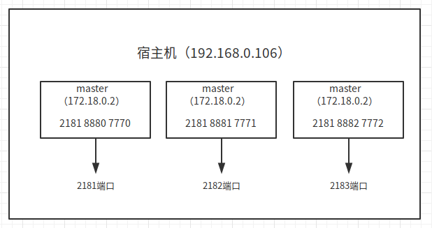

## pc
0.安装
参考：  
https://dev.zte.com.cn/topic/#/46129
https://dev.zte.com.cn/topic/#/23795
https://dev.zte.com.cn/topic/#/46478
https://dev.zte.com.cn/topic/#/44846


1.环境配置  

cd /etc/systemd/system/docker.service.d

touch http-proxy.conf
```
[Service]
Environment="HTTP_PROXY=http://proxysh.zte.com.cn:80/"
```

export http_proxy=http://proxysh.zte.com.cn:80/  
export https_proxy=https://proxysh.zte.com.cn:80/

2.镜像  
(1)制品库docker证书失效处理办法（解决X509）  
参考：http://i.zte.com.cn/#/space/97bcb103724e478a8df067226cf396f5/wiki/page/382baed82d594e8483bad153ba6192fa/view

Ubuntu: 
文件：/etc/default/docker 
把OPTIONS里面添加参数的"--insecure-registry  0.0.0.0/0"  
部分docker的配置文件为/etc/docker/daemon.json ,如果没有此文件那么手工创建
```
"insecure-registries" : [ "0.0.0.0/0" ]
```
重启docker服务：service docker restart  或者 systemctl restart docker  

检查参数生效： 通过以下命令能看到0.0.0.0等字样 。 说明：如果是通过daemon.json文件配置的0.0.0.0，那么通过ps -ef|grep docker不会看到0.0.0.0字样，请直接验证功能

docker pull  public-docker-virtual.artnj.zte.com.cn/ubuntu:16.04  
docker run -it -p 80:80 --name ubuntu16.04 --net="host" 5e1 /bin/bash


docker cp /home/webmnt/Desktop/sources.list fec:/etc/apt/  
docker cp /sbin/ifconfig fec:/sbin/


## container
export http_proxy=http://proxysh.zte.com.cn:80/  
export https_proxy=https://proxysh.zte.com.cn:80/

## 使用
### 1、 保存镜像  
docker commit -m 'python ifconfig vim' fec ubuntu:python


docker run -it -h master --name master ubuntu/sshd  
docker run -it -h slave01 --name slave01 ubuntu/sshd  
docker run -it -h slave02 --name slave02 ubuntu/sshd

### 2、ssh相关
```bash
# 启动ssh服务
/etc/init.d/ssh start

# 开机自动启动ssh命令
sudo systemctl enable ssh

# 关闭ssh开机自动启动命令
sudo systemctl disable ssh

# 单次开启ssh
sudo systemctl start ssh

# 单次关闭ssh
sudo systemctl stop ssh

# 设置好后重启系统
reboot

```
### 3、问题  
docker的ubuntu镜像无ifconfig和ping命令  
或者 ubuntu系统中无ifconfig和ping

apt-get update

apt-get install net-tools

apt-get install iputils-ping


### 4、升级python
首先配置好/etc/apt/sources.list
```bash
# deb cdrom:[Ubuntu 18.04.1 LTS _Bionic Beaver_ - Release amd64 (20180725)]/ bionic main restricted

# See http://help.ubuntu.com/community/UpgradeNotes for how to upgrade to
# newer versions of the distribution.
deb http://mirrors.aliyun.com/ubuntu/ bionic main restricted
# deb-src http://cn.mirrors.ustc.edu.cn/ubuntu/ bionic main restricted

## Major bug fix updates produced after the final release of the
## distribution.
deb http://mirrors.aliyun.com/ubuntu/ bionic-updates main restricted
# deb-src http://cn.mirrors.ustc.edu.cn/ubuntu/ bionic-updates main restricted

## N.B. software from this repository is ENTIRELY UNSUPPORTED by the Ubuntu
## team. Also, please note that software in universe WILL NOT receive any
## review or updates from the Ubuntu security team.
deb http://mirrors.aliyun.com/ubuntu/ bionic universe
# deb-src http://cn.mirrors.ustc.edu.cn/ubuntu/ bionic universe
deb http://mirrors.aliyun.com/ubuntu/ bionic-updates universe
# deb-src http://cn.mirrors.ustc.edu.cn/ubuntu/ bionic-updates universe

## N.B. software from this repository is ENTIRELY UNSUPPORTED by the Ubuntu 
## team, and may not be under a free licence. Please satisfy yourself as to 
## your rights to use the software. Also, please note that software in 
## multiverse WILL NOT receive any review or updates from the Ubuntu
## security team.
deb http://mirrors.aliyun.com/ubuntu/ bionic multiverse
# deb-src http://cn.mirrors.ustc.edu.cn/ubuntu/ bionic multiverse
deb http://mirrors.aliyun.com/ubuntu/ bionic-updates multiverse
# deb-src http://cn.mirrors.ustc.edu.cn/ubuntu/ bionic-updates multiverse

## N.B. software from this repository may not have been tested as
## extensively as that contained in the main release, although it includes
## newer versions of some applications which may provide useful features.
## Also, please note that software in backports WILL NOT receive any review
## or updates from the Ubuntu security team.
deb http://mirrors.aliyun.com/ubuntu/ bionic-backports main restricted universe multiverse
# deb-src http://cn.mirrors.ustc.edu.cn/ubuntu/ bionic-backports main restricted universe multiverse

## Uncomment the following two lines to add software from Canonical's
## 'partner' repository.
## This software is not part of Ubuntu, but is offered by Canonical and the
## respective vendors as a service to Ubuntu users.
# deb http://archive.canonical.com/ubuntu bionic partner
# deb-src http://archive.canonical.com/ubuntu bionic partner

deb http://mirrors.aliyun.com/ubuntu/ bionic-security main restricted
# deb-src http://security.ubuntu.com/ubuntu bionic-security main restricted
deb http://mirrors.aliyun.com/ubuntu/ bionic-security universe
# deb-src http://security.ubuntu.com/ubuntu bionic-security universe
deb http://mirrors.aliyun.com/ubuntu/ bionic-security multiverse
# deb-src http://security.ubuntu.com/ubuntu bionic-security multiverse

deb http://mirrors.aliyun.com/ubuntu/ bionic restricted multiverse
deb-src http://mirrors.aliyun.com/ubuntu/ bionic main restricted universe multiverse

deb http://mirrors.aliyun.com/ubuntu/ bionic-security restricted multiverse
deb-src http://mirrors.aliyun.com/ubuntu/ bionic-security main restricted universe multiverse

deb http://mirrors.aliyun.com/ubuntu/ bionic-updates restricted multiverse
deb-src http://mirrors.aliyun.com/ubuntu/ bionic-updates main restricted universe multiverse

deb http://mirrors.aliyun.com/ubuntu/ bionic-proposed main restricted universe multiverse
deb-src http://mirrors.aliyun.com/ubuntu/ bionic-proposed main restricted universe multiverse

deb http://mirrors.aliyun.com/ubuntu/ bionic-backports restricted multiverse
deb-src http://mirrors.aliyun.com/ubuntu/ bionic-backports main restricted universe multiverse

deb [arch=amd64] https://mirrors.ustc.edu.cn/docker-ce/linux/ubuntu bionic stable
# deb-src [arch=amd64] https://mirrors.ustc.edu.cn/docker-ce/linux/ubuntu bionic stable
```
直接运行
```bash
sudo apt-get install python-dev
sudo apt-get install libffi-dev
sudo apt-get install libssl-dev
sudo apt-get install libxml2-dev
sudo apt-get install libxslt-dev
sudo apt-get install libmysqlclient-dev
sudo apt-get install libsqlite3-dev
sudo apt-get install zlib1g-dev
sudo apt-get install libgdbm-dev
```
然后就自动升级为了python2.7.15  

如果还需要安装pip的话，则：
```bash
wget https://bootstrap.pypa.io/ez_setup.py -O - | sudo python

curl -O https://bootstrap.pypa.io/get-pip.py
python get-pip.py
```

具体参考：https://blog.csdn.net/fengmm521/article/details/79875293

### 5、docker删除不掉镜像
```
Error response from daemon: conflict: unable to delete 152dbcfa1a6c (cannot be forced) - image has dependent child images
Error response from daemon: conflict: unable to delete 8565714b5eb7 (cannot be forced) - image has dependent child images
```
参考：https://blog.csdn.net/sin_geek/article/details/86736417

### 6、运行
docker run -it -h master --name master ubuntu/hadoopinstalled

### 7、ssh问题
/etc/ssh/sshd_config
```bash
# Package generated configuration file
# See the sshd_config(5) manpage for details

# What ports, IPs and protocols we listen for
Port 22
# Use these options to restrict which interfaces/protocols sshd will bind to
#ListenAddress ::
#ListenAddress 0.0.0.0
Protocol 2
# HostKeys for protocol version 2
HostKey /etc/ssh/ssh_host_rsa_key
HostKey /etc/ssh/ssh_host_dsa_key
HostKey /etc/ssh/ssh_host_ecdsa_key
HostKey /etc/ssh/ssh_host_ed25519_key
#Privilege Separation is turned on for security
UsePrivilegeSeparation yes

# Lifetime and size of ephemeral version 1 server key
KeyRegenerationInterval 3600
ServerKeyBits 1024

# Logging
SyslogFacility AUTH
LogLevel INFO

# Authentication:
LoginGraceTime 120
PermitRootLogin yes
StrictModes yes

RSAAuthentication yes
PubkeyAuthentication yes
#AuthorizedKeysFile	%h/.ssh/authorized_keys

# Don't read the user's ~/.rhosts and ~/.shosts files
IgnoreRhosts yes
# For this to work you will also need host keys in /etc/ssh_known_hosts
RhostsRSAAuthentication no
# similar for protocol version 2
HostbasedAuthentication no
# Uncomment if you don't trust ~/.ssh/known_hosts for RhostsRSAAuthentication
#IgnoreUserKnownHosts yes

# To enable empty passwords, change to yes (NOT RECOMMENDED)
PermitEmptyPasswords yes

# Change to yes to enable challenge-response passwords (beware issues with
# some PAM modules and threads)
ChallengeResponseAuthentication no

# Change to no to disable tunnelled clear text passwords
PasswordAuthentication yes

# Kerberos options
#KerberosAuthentication no
#KerberosGetAFSToken no
#KerberosOrLocalPasswd yes
#KerberosTicketCleanup yes

# GSSAPI options
#GSSAPIAuthentication no
#GSSAPICleanupCredentials yes

X11Forwarding yes
X11DisplayOffset 10
PrintMotd no
PrintLastLog yes
TCPKeepAlive yes
#UseLogin no

#MaxStartups 10:30:60
#Banner /etc/issue.net

# Allow client to pass locale environment variables
AcceptEnv LANG LC_*

Subsystem sftp /usr/lib/openssh/sftp-server

# Set this to 'yes' to enable PAM authentication, account processing,
# and session processing. If this is enabled, PAM authentication will
# be allowed through the ChallengeResponseAuthentication and
# PasswordAuthentication.  Depending on your PAM configuration,
# PAM authentication via ChallengeResponseAuthentication may bypass
# the setting of "PermitRootLogin without-password".
# If you just want the PAM account and session checks to run without
# PAM authentication, then enable this but set PasswordAuthentication
# and ChallengeResponseAuthentication to 'no'.
UsePAM yes

```

ssh命令:
```bash
/etc/init.d/ssh start
/etc/init.d/ssh restart
/etc/init.d/ssh status
```

core-site.xml
```xml
<configuration>
      <property>
          <name>hadoop.tmp.dir</name>
          <value>file:/usr/local/hadoop-2.6.5/tmp</value>
          <description>Abase for other temporary directories.</description>
      </property>
      <property>
          <name>fs.defaultFS</name>
          <value>hdfs://master:9000</value>
      </property>
</configuration>

```

mapred-site.xml
```xml
<configuration>
    <property>
        <name>mapreduce.framework.name</name>
        <value>yarn</value>
    </property>
</configuration>

```

yarn-site.xml
```xml
<configuration>
  <!-- Site specific YARN configuration properties -->
      <property>
          <name>yarn.nodemanager.aux-services</name>
          <value>mapreduce_shuffle</value>
      </property>
      <property>
          <name>yarn.nodemanager.aux-services.mapreduce.shuffle.class</name>
          <value>org.apache.hadoop.mapred.ShuffleHandler</value>
      </property>
      <property>
          <name>yarn.resourcemanager.address</name>
          <value>master:8032</value>
      </property>
      <property>
          <name>yarn.resourcemanager.scheduler.address</name>
          <value>master:8030</value>
      </property>
      <property>
          <name>yarn.resourcemanager.resource-tracker.address</name>
          <value>master:8035</value>
      </property>
      <property>
          <name>yarn.resourcemanager.admin.address</name>
          <value>master:8033</value>
      </property>
      <property>
          <name>yarn.resourcemanager.webapp.address</name>
          <value>master:8088</value>
      </property>
</configuration>
```


hdfs-site.xml
```xml
<configuration>
    <property>
        <name>dfs.namenode.secondary.http-address</name>
        <value>master:9001</value>
    </property>
    <property>
        <name>dfs.namenode.name.dir</name>
        <value>file:/usr/local/hadoop-2.6.5/dfs/name</value>
    </property>
    <property>
        <name>dfs.datanode.data.dir</name>
        <value>file:/usr/local/hadoop-2.6.5/dfs/data</value>
    </property>
    <property>
        <name>dfs.replication</name>
        <value>3</value>
    </property>
</configuration>
```

hadoop-env.sh
```bash
export JAVA_HOME=/usr/local/jdk1.8.0_181
```
yarn-env.sh
```bash
export JAVA_HOME=/usr/local/jdk1.8.0_181
```


最后：
```bash
scp -rp hadoop/ slave1:/usr/local/hadoop-2.6.5/etc
scp -rp hadoop/ slave2:/usr/local/hadoop-2.6.5/etc
```

### 8、启动容器以后
1) 修改/etc/hosts
```bash
172.17.0.2	master
172.17.0.3	slave1
172.17.0.4	slave2
```
2) 启动ssh
```bash
/etc/init.d/ssh start
```

3) password  
qwe123

### 9、python.h 没有那个文件或目录
如果你使用的是python2.x，那么使用下面的语句：

sudo apt-get install python-dev 

如果你使用的是python3.x，那么使用下面的语句：
sudo apt-get install python3-dev

pip install zookeeper
pip install zkpython

import  zookeeper
如果报错，请在.bashrc文件中加入  
```SH
export LD_LIBRARY_PATH=/usr/local/lib/
```
### 10、python2/3冲突
修改python

1) 方法一：修改别名  
可以采用alias修改别名将python设置为python3
```bash
alias python='/usr/bin/python3'1
```  
并将其放入.bashrc中

2) 方法二：修改配置
```bash
sudo update-alternatives --install /usr/bin/python python /usr/bin/python2.7 2 
# 添加Python2可选项，优先级为2
sudo update-alternatives --install /usr/bin/python python /usr/bin/python3.6 1 
# 添加Python3可选项，优先级为1
sudo update-alternatives --config python 
```
出现如下配置菜单，发现现在是自动模式，选择python2，要设置为python3只需要选择2，enter即可啦～


### 11、zookeeper的报错
1)  myid文件缺失导致zookeeper无法启动（myid file is missing）  
在zoo.cfg中指定的dataDir目录中创建文件myid，里面只需要填写你设置的server编号即可。如下：
```
server.0=master:8880:7770
server.1=slave1:8881:7771
server.2=slave2:8882:7772
```

则在master的dataDir下创建myid文件，写入0  
则在slave1的dataDir下创建myid文件，写入1  
则在slave2的dataDir下创建myid文件，写入2  

2)  WARN  [WorkerSender[myid=0]:QuorumCnxManager@368] - Cannot open channel to 1 at election address slave1/172.17.0.3:7771
- 关防火墙
- 在zoo.cfg中修改本主机的ip为0.0.0.0
- 需要对其myid
- 需要**同时**_开启三个节点(一个主节点，两个从节点))

docker外围网络搭建示意图  

```bash
# 创建zoonet
docker network create --driver bridge --subnet=172.18.0.0/16 --gateway=172.18.0.1 zoonet

# 启动各个容器
docker run -it -p 2181:2181 -h master --name master --privileged --network zoonet --ip 172.18.0.2  ubuntu/master 

docker run -it -p 2182:2181 -h slave1 --name slave1 --privileged --network zoonet --ip 172.18.0.3 ubuntu/slave1

docker run -it -p 2183:2181 -h slave2 --name slave2 --privileged --network zoonet --ip 172.18.0.4 ubuntu/slave2
```

172.18.0.2      master
172.18.0.3      slave1
172.18.0.4      slave2